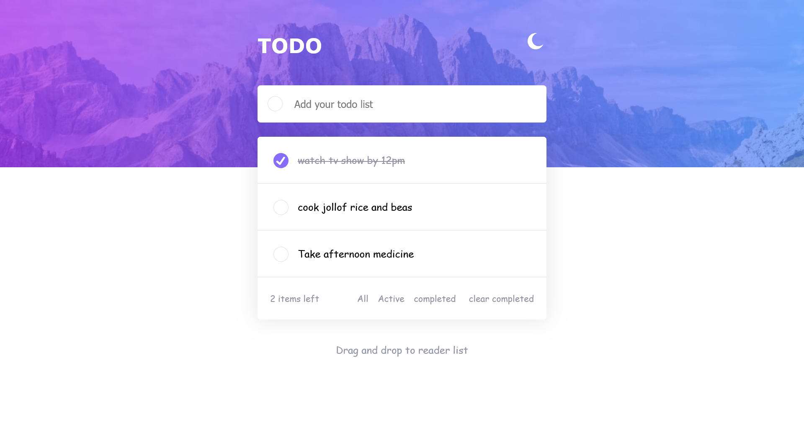
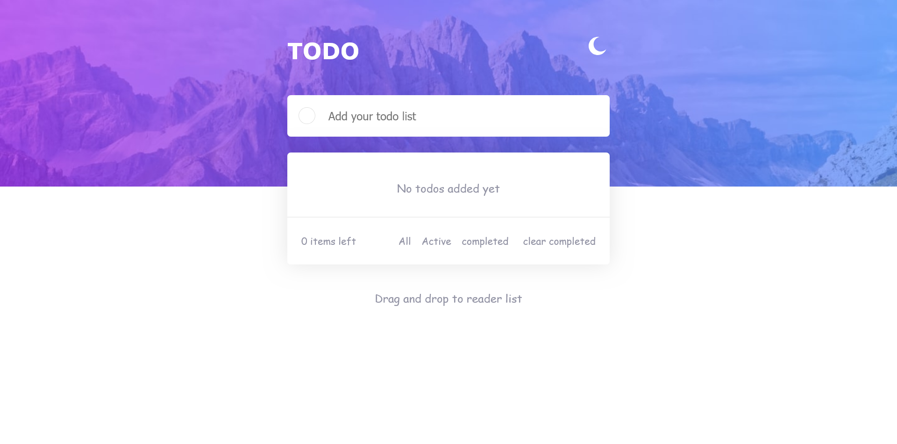
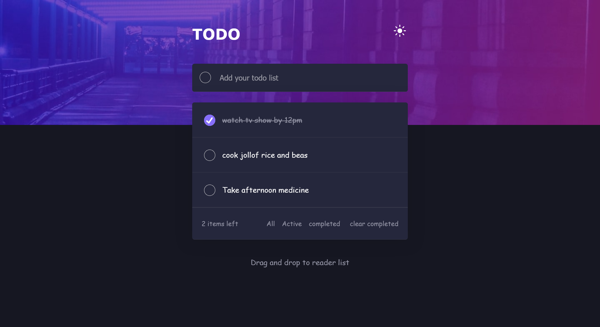
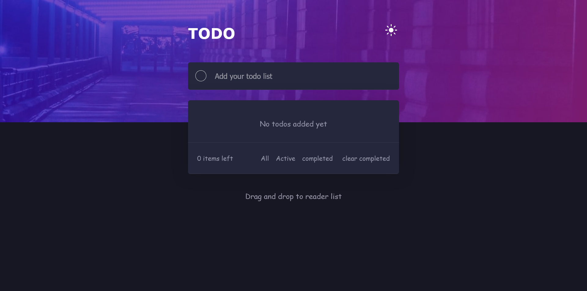
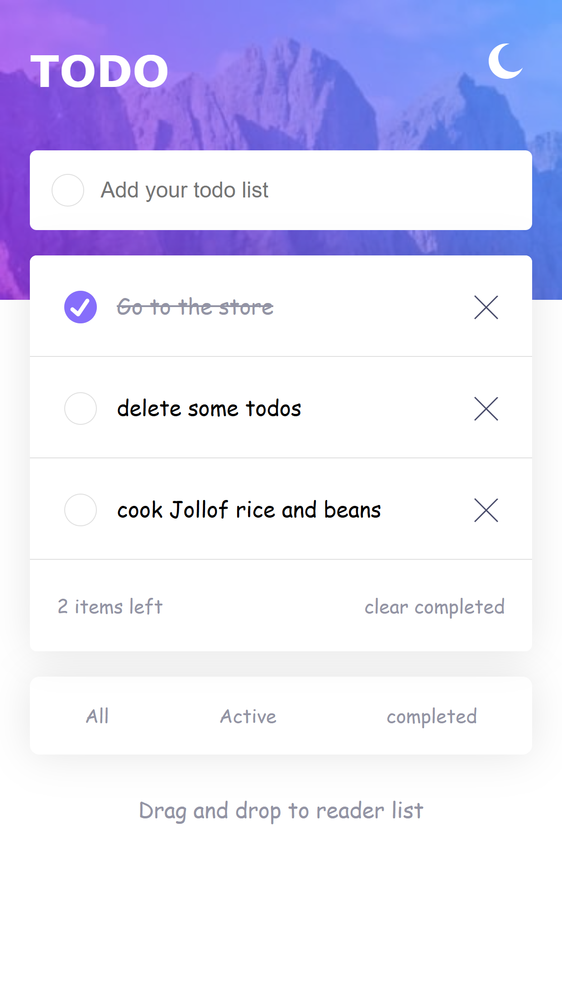
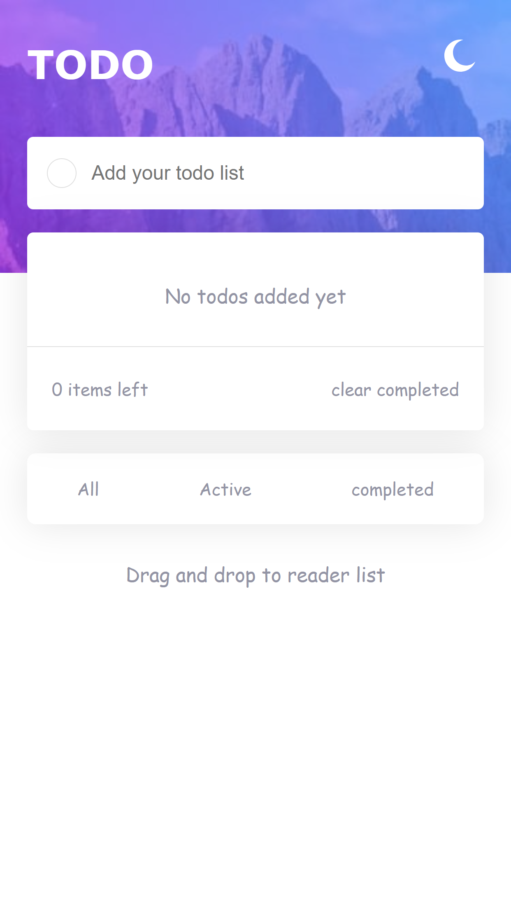
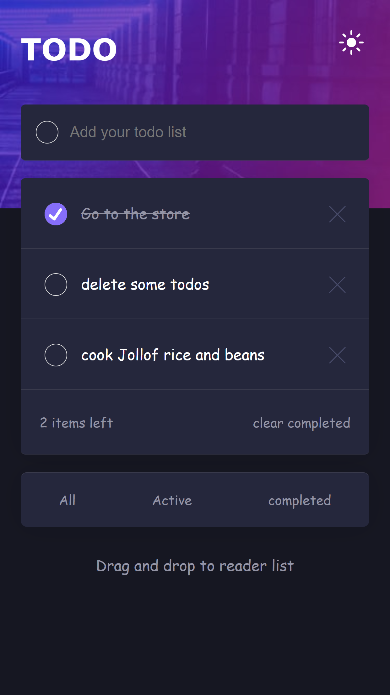
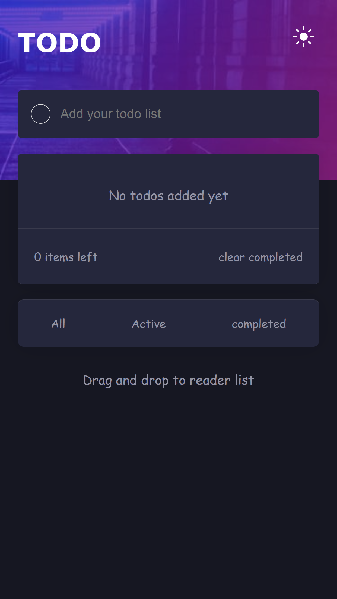

# ToDoList

Realistic TodoList Web Application using django and html, css and javascript. this todos authenticate and saves user data to the backend django and toggles to light and dark mode with reader drop list and also responsive.

## Overview

Users should be able to:

- View the optimal layout for the app depending on their device's screen size
- See hover states for all interactive elements on the page
- Add new todos to the list
- Mark todos as complete
- Delete todos from the list
- Filter by all/active/complete todos
- Clear all completed todos
- Toggle light and dark mode
- **Bonus**: Drag and drop to reorder items on the list

### Built with

- Semantic HTML5 markup
- CSS custom properties
- CSS Grid
- Mobile-first workflow

<h3>Todolist overview</h3>
<h4>todolist webapp is a responsive web application for both tablet, phone and tablet mode</h4>

<h1>Desktop mode view</h1>

## Desktop light mode with data

here is an overview of light mode for desktop mode

## Desktop light mode with no data

here is an overview of light mode for desktop mode with no data

<h3>Desktop mode</h3>

## Desktop dark mode with data

here is an overview of dark mode for desktop mode

## Dark dark mode with data

here is an overview of dark mode for desktop mode

<h1>mobile mode view</h1>

## mobile light mode with data

here is an overview of light mode for mobile mode

## mobile light mode with no data

here is an overview of light mode for mobile mode

<h3>Dark mode</h3>

## mobile dark mode with data

here is an overview of dark mode for mobile mode

## mobile dark mode with no data

here is an overview of dark mode for mobile mode

